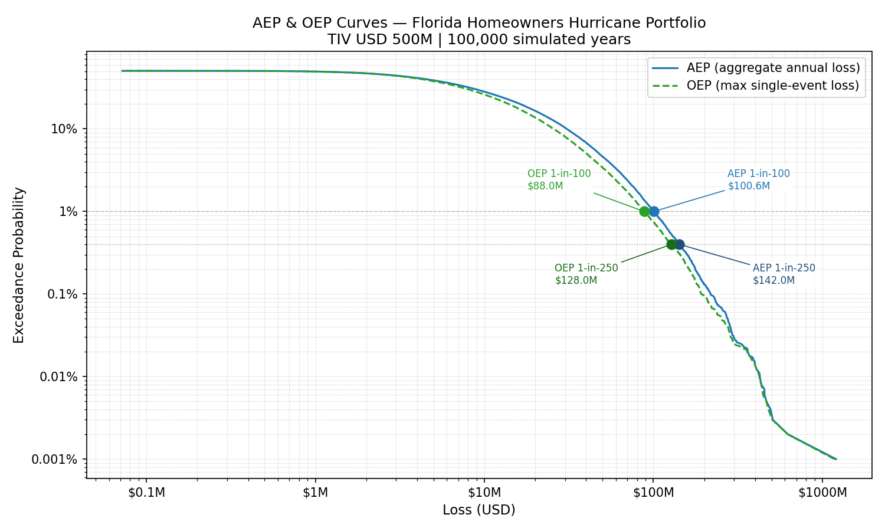

# Hurricane Catastrophe Model — Florida Homeowners Portfolio

A compound-Poisson Monte Carlo catastrophe model that prices the tail risk of a
residential hurricane portfolio. The model simulates 100,000 years of possible
loss experience, builds the Aggregate (AEP) and Occurrence (OEP) Exceedance
Probability curves, and reads the Probable Maximum Loss (PML) at the 1-in-100 and
1-in-250 year return periods.

> **Note on scope.** This is a learning/portfolio project built to demonstrate the
> conceptual engine behind production catastrophe models (RMS, Verisk Touchstone).
> The *method* mirrors industry practice; the *input parameters* are illustrative,
> not calibrated to real data. See [Assumptions](#assumptions).

---

## The problem

An insurer can comfortably pay for the *average* year. It is bankrupted by the
*bad* year. For a hurricane book, average annual losses are modest, but there is a
real chance of a single catastrophic season that costs an order of magnitude more.
Pricing this risk — and deciding how much capital and reinsurance to hold — requires
the full loss distribution, not just its mean. This model produces that distribution
and extracts the tail metrics the industry actually uses.

## Methodology

The model follows the standard **frequency–severity** decomposition used by every
catastrophe model:

- **Frequency** — the number of loss-causing events in a year is modeled as
  `N ~ Poisson(λ)`.
- **Severity** — given an event occurs, its loss to the portfolio is drawn from a
  **Lognormal** distribution, chosen for its positive support and heavy right tail.
- **Aggregate annual loss** — combining the two gives a **compound Poisson** process:
  `S = X₁ + X₂ + … + X_N`, the total loss in a given year.

The annual loss `S` is simulated for 100,000 years via Monte Carlo. The resulting
sample of 100,000 annual losses *is* the loss distribution of the portfolio; the EP
curves and PMLs are simply that distribution read at the appropriate ranks.

- **AEP (Aggregate Exceedance Probability)** ranks the *total* annual loss `S`. It is
  the relevant view for aggregate covers and capital adequacy.
- **OEP (Occurrence Exceedance Probability)** ranks the *largest single event* of each
  year. It is the relevant view for per-occurrence reinsurance (catastrophe XoL).

For a return period `T`, the PML is the loss whose annual exceedance probability is
`1/T` — i.e. the loss at rank `k = M / T` once losses are sorted descending.

## Parameters and assumptions

| Parameter | Value | Notes |
|---|---|---|
| Peril / region | Atlantic hurricane, Florida coastal homeowners | Canonical cat peril |
| Total insured value (TIV) | USD 500,000,000 | Sanity ceiling for losses |
| Frequency | `N ~ Poisson(λ = 0.7)` | ≈ 1 material event every 1.4 years |
| Severity | `Lognormal`, mean = USD 15M, CV = 1.5 | Heavy-tailed per-event loss |
| Severity log-parameters | `μ = 15.9342`, `σ = 1.0857` | Derived from mean and CV (see below) |
| Simulation | 100,000 years, `seed = 42` | Reproducible |

The Lognormal is parameterized from an arithmetic mean and coefficient of variation,
converted to log-space parameters:

```
σ = sqrt( ln(1 + CV²) )            = sqrt(ln(3.25))         ≈ 1.0857
μ = ln(mean) − σ²/2                = ln(15e6) − 0.5894      ≈ 15.9342
```

The `−σ²/2` correction is essential: it offsets the upward pull of the tail so the
arithmetic mean lands exactly on USD 15M. Omitting it (passing `ln(mean)` as `μ`)
silently inflates the mean by orders of magnitude — a classic modeling error caught
by the AAL validation below.

> **Assumptions are illustrative.** `λ`, the severity mean, the CV and the TIV are
> chosen to be plausible and to make the dynamics visible — they are not estimated
> from data. In production, frequency comes from a stochastic event catalog (e.g.
> built on NOAA HURDAT2) rather than a single `λ`, and severity comes from
> engineering-based vulnerability functions. The historical record is too short to
> observe the deep tail directly, which is precisely why stochastic catalogs exist.

## Results

| Metric | Value |
|---|---|
| Average Annual Loss (AAL) | USD 10.49M (theoretical `λ·E[X]` = 10.50M) |
| AEP PML, 1-in-100 | USD 100.6M |
| AEP PML, 1-in-250 | USD 142.0M |
| OEP PML, 1-in-100 | USD 88.0M |
| OEP PML, 1-in-250 | USD 128.0M |

The headline story is the gap between the AAL (≈ USD 10.5M) and the 1-in-250 PML
(≈ USD 142M). A year that bad costs more than 13× the average year and ≈ 28% of TIV
— this is the heavy tail made concrete, and it is the entire reason reinsurance and
risk capital exist.

The OEP curve sits below the AEP curve everywhere (the largest single event cannot
exceed the sum of all events) and the two converge into the tail, where catastrophic
years are dominated by a single large hurricane and "the maximum" and "the sum"
nearly coincide.



## Validation

The model is checked against three independent theoretical anchors, each targeting a
different component:

1. **Frequency** — the simulated mean of `N` converges to `λ = 0.7`, within the
   expected sampling error `√(λ/M) ≈ 0.0027`.
2. **Severity / aggregation** — the simulated AAL converges to the closed-form
   `λ · E[X] = USD 10.5M` (relative error 0.127%). This confirms both the Lognormal
   parameter conversion and the compound-Poisson aggregation.
3. **Zero-loss years** — the share of years with no loss matches `e^(−λ) ≈ 49.66%`
   (simulated 49.53%). Equivalently, the AEP curve plateaus at
   `P(S > 0) = 1 − e^(−λ) ≈ 50.3%`, confirming the event-count handling survived the
   severity layer intact.

Three anchors hitting their targets simultaneously is strong evidence the model is
assembled correctly — mirroring how an analyst cross-checks an output before trusting
it, rather than relying on a single number.

## Limitations

- **Deep-tail noise.** Return periods beyond ≈ 1-in-2,000 rest on very few simulated
  years (the 1-in-10,000 point uses ~10 of 100,000 years) and become visibly noisy.
  Estimates in that region exist but should not be read with precision.
- **Portfolio-aggregate resolution.** Losses are modeled directly at portfolio level
  rather than location-by-location with vulnerability functions and hazard footprints,
  as production vendor models do.
- **Single peril, no correlation structure** beyond what the frequency model implies;
  no secondary uncertainty, demand surge, or financial-structure (deductibles, limits)
  modeling.

## Repository structure

```
hurricane-cat-model/
├── README.md
├── model/
│   ├── sanity_check.py     # Poisson frequency validation
│   ├── aggregate_loss.py   # compound-Poisson annual loss S
│   └── ep_curve.py         # AEP/OEP curves, PMLs, plots
└── outputs/
    └── ep_curves.png
```

## How to run

```bash
pip install numpy pandas matplotlib
python model/ep_curve.py
```

Outputs the AAL and four PMLs to the console and saves the EP-curve plot to
`outputs/`. A fixed seed (`42`) makes all results reproducible.

**Stack:** Python · NumPy · pandas · matplotlib

## Future extensions

- Replace the single `λ` with a stochastic event catalog.
- Model the tail with a Generalized Pareto Distribution (peaks-over-threshold) instead
  of a single Lognormal.
- Move from portfolio-aggregate to location-level exposure with vulnerability curves.
- Reproduce the workflow in the open-source [Oasis LMF](https://oasislmf.org) framework.
- Layer reinsurance structures (XoL, quota share) on top of the gross loss distribution.
