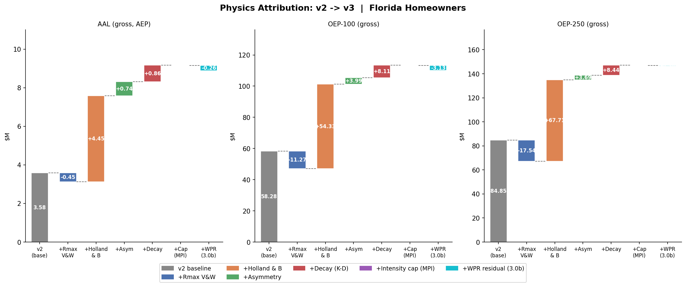

# Florida Hurricane Catastrophe Model

**A location-level, stochastic Monte Carlo catastrophe model for a Florida coastal homeowners portfolio — from individual exposures through hazard, vulnerability, policy terms, and a multi-layer reinsurance programme, producing gross and net exceedance-probability curves.**

The model builds a book of 1,000 insured locations, simulates 100,000 years of stochastic hurricanes as moving wind footprints, translates wind to damage through construction-specific vulnerability curves, applies per-policy financial terms, and prices the effect of an excess-of-loss (XoL) reinsurance tower on the portfolio's tail — reporting the loss distribution **gross and net of reinsurance**.

> **Note on scope.** A learning / portfolio project built to demonstrate the conceptual engine behind production catastrophe models (RMS, Verisk Touchstone, CoreLogic). The *method* follow the conceptual structure of a vendor-model pipeline — exposure, hazard, vulnerability, financial, and reinsurance — not just aggregate loss simulation. In v3, the hazard is calibrated to NOAA HURDAT2 end-to-end — frequency, intensity, and landfall geography (Phase 1), plus a physical wind field of Holland profiles, intensity-dependent storm sizing, forward-motion asymmetry, and inland decay (Phase 2). Vulnerability and financial parameters remain illustrative pending later phases. See [Assumptions](#parameters-and-assumptions) and [Limitations](#limitations).

---

## The pipeline at a glance

```
1. Exposure        generate_exposure.py   1,000 FL coastal locations, USD 500M TIV
2. Hazard          hazard.py              stochastic moving-track storms -> wind per location
3. Vulnerability   vulnerability.py       HAZUS-anchored damage curves by construction
4. Financial       loss.py                ground-up -> gross (per-occurrence deductibles)
5. Reinsurance     reinsurance.py         per-occurrence XoL tower -> net
6. EP metrics      summary.py             AEP & OEP, gross & net, PMLs
                   run_all.py             runs the whole chain end-to-end
```

---

## Headline results

A synthetic but plausible book: **1,000 coastal locations, USD 500M total insured value (TIV)**, over 100,000 simulated years, with a fully calibrated v3 hazard.

| Metric (USD M) | AEP Gross | AEP Net | OEP Gross | OEP Net |
|---|---:|---:|---:|---:|
| Average Annual Loss | 9.15 | 7.71 | 8.47 | 7.04 |
| PML 1-in-100 | 122.4 | 70.3 | 113.2 | 60.0 |
| PML 1-in-250 | 158.7 | 90.6 | 146.9 | 60.0 |

*AEP = Aggregate Exceedance Probability (full annual loss). OEP = Occurrence Exceedance Probability (largest single event of the year). Gross = before reinsurance; Net = after the XoL tower.*

These are the **v3 numbers**: a hazard calibrated to HURDAT2 end-to-end — frequency, intensity, and landfall geography (Phase 1), and a physical wind field of Holland profiles, Vickery-Wadhera storm sizing, forward-motion asymmetry, and Kaplan-DeMaria inland decay (Phase 2). The AAL sits at **1.83% of TIV**, in the plausible range for a coastal Florida book. How the model evolved from its illustrative v2.0 baseline — and what each calibration step contributed — is documented in [Calibration: v2 → v3](#calibration-v2--v3).

**Two independent validations.** The v3 PMLs (OEP 113.2M / 146.9M at 1-in-100 / 1-in-250) land close to the original v1 parametric reference (100M / 142M) — two entirely different model architectures converging on the same tail. And every component of the v2→v3 change is decomposed in an attribution waterfall whose endpoints reproduce the v2 and v3 totals exactly.

**What the reinsurance tower buys:** gross-to-net PML reduction of **−47.0% / −59.2%** on a per-occurrence basis (1-in-100 / 1-in-250). A detail worth reading off the numbers: the **OEP net flattens at exactly USD 60M at both return periods**. Because the contiguous tower covers every dollar from the 60M retention up to 200M exhaustion, any single event that pierces the programme leaves the insurer with exactly its 60M retention. The **AEP net does *not* flatten**, because a bad year can stack several retentions from multiple events, none of which individually triggers the full tower.

---

## Calibration: v2 → v3

The v2 model used illustrative parameters throughout. Phase 1 of v3 replaces the
hazard parameters — frequency, intensity, landfall geography, and storm track — with
estimates calibrated to NOAA's HURDAT2 Atlantic hurricane database (1851–2024). This
section documents how the headline numbers changed and, more importantly, why.

### The headline shift

| State | AAL gross (AEP) | What changed |
|---|---:|---|
| **v2.0** (frozen) | 10.67M | All hazard parameters illustrative |
| **v3 intermediate** | 9.35M | + calibrated frequency & intensity |
| **v3 Phase 1** | 3.58M | + calibrated landfall geography & track |

The change decomposes into two jumps:

**Jump 1 — frequency + intensity (−12%, 10.67M → 9.35M).** The annual landfall rate λ
moved from the illustrative 0.7 to 0.6576, estimated via a Poisson GLM conditioned on
the Atlantic Multidecadal Oscillation (current-climate value; see Step 1.3b). Intensity
moved from discrete Saffir-Simpson category sampling to a continuous truncated-lognormal
fitted to landfall Vmax. Both are modest, conservative changes — the mean storm
intensity barely moved (−0.7%); the lognormal mainly corrected the over-representation
of the extreme tail that uniform-within-category sampling introduced.

**Jump 2 — landfall geography + track (−62%, 9.35M → 3.58M).** This is the large,
revealing shift. The v2 model placed landfalls using hand-tuned coastal segment weights
that happened to concentrate storms in the southeast and southwest — coincidentally
where the synthetic portfolio holds its TIV. The calibrated landfall geography (a KDE
over arc-length projected onto the TIGER coastline) distributes storms realistically
along the entire Florida coast. The consequence: **26.6% of simulated landfalls now
strike the panhandle (west of −84° longitude), where the portfolio has zero exposure.**
Storm heading was also conditioned on the approach regime (Atlantic landfalls move NW,
Gulf landfalls move NE — a von Mises distribution per regime, replacing a uniform
±45° draw), which spreads tracks away from the densely-exposed east coast.

### What this reveals

The −62% drop is not a model defect — it is a correct emergent property. The realistic
hazard exposes that the synthetic portfolio has a geographically concentrated risk
profile: it captures southeast/southwest Florida risk but is blind to panhandle
landfalls. When the hazard was illustrative, its hand-tuned weights happened to align
with the TIV, inflating the AAL. A calibrated hazard removes that artificial alignment
and shows the portfolio's true exposure footprint — exactly the kind of insight a
realistic catastrophe model is supposed to surface.

### A note on attribution granularity

This analysis decomposes the change into two jumps (calibration-of-magnitude and
calibration-of-geography). A finer, component-by-component attribution waterfall
(frequency / intensity / geography / heading / and the Phase 2 wind physics) is
deferred to Phase 2, where per-component configuration switches are built as
infrastructure the wind-physics comparisons require anyway.

### Phase 2 — physical wind field

Phase 1 calibrated *where, how often, and how intense* storms strike. Phase 2 replaces the illustrative wind field itself — how a storm's wind translates to a footprint over the portfolio — with a calibrated physical chain. Every placeholder from v2 is replaced by a published, sourced component:

| Component | v2 placeholder | v3 physical model |
|---|---|---|
| Wind-pressure | — | Δp fitted to CONUS landfalls (Atkinson-Holliday form) |
| Storm size (Rmax) | uniform(30–55 km) | Vickery & Wadhera (2008), intensity-dependent |
| Profile shape (B) | — | Vickery & Wadhera (2008), coupled to Rmax |
| Radial profile | modified Rankine | Holland (1980) gradient-balance, anchored to Vmax |
| Asymmetry | none | Schwerdt–HAZUS forward-motion correction |
| Inland decay | 120 km e-folding | Kaplan & DeMaria (1995), coupled to translation speed |

The chain is causal: sampled Vmax drives a central-pressure deficit Δp (via a wind-pressure relationship fitted to Atlantic CONUS landfalls), Δp and latitude drive the storm's size and profile peakedness (Vickery-Wadhera), and those feed the Holland gradient-balance profile. Forward motion then breaks the radial symmetry (right-of-track winds enhanced), and Kaplan-DeMaria decays the wind inland as a function of time since landfall — so a fast storm carries damaging wind further inland than a slow one.

> **A methodological note on anchoring.** The Holland profile is parameterized by Δp, but our intensity calibration is on landfall Vmax (HURDAT2, n=112) — a better-constrained quantity than the WPR-derived Δp (n=85). So the Holland profile supplies the radial *shape*, while Vmax supplies the *amplitude*: the profile is normalized and scaled so its peak equals the sampled Vmax. This is standard practice in production cat models, and it keeps the model's intensity tied to its strongest calibration.

### Intensity bounding via Maximum Potential Intensity (MPI)

The landfall distribution is doubly truncated: lower at 64 kt (the HU definitional threshold) and upper at **165 kt** (the empirical Atlantic MPI at SST ≈ 30°C). The MPI formula is DeMaria & Kaplan (1994): V = 28.2 + 55.8·exp(0.1813·(T−30)) m/s ≈ 163 kt at T=30°C; the cap rounds to 165 kt, sitting 5 kt above the HURDAT2 Atlantic landfall record (Labor Day 1935, Dorian 2019) — a physical ceiling, not a data ceiling.

**Why MPI rather than the record?** The observed record is a censored sample — storms stronger than any landfalling event may be physically possible; MPI bounds the attainable intensity thermodynamically.

**Renormalization, not clipping.** The inverse-CDF sampler maps a uniform U∈[0,1) into [p_lb, p_ub] instead of [p_lb, 1). This rescales the density by the dimensionless factor (p_ub − p_lb)/(1 − p_lb) ≈ 0.9961; the observable effect on sub-cap intensities is a downward shift of less than 0.5 mph for Cat1–3 draws (< 111 kt) — gentle, as the 3.0a tests confirm. Clipping (capping post-draw) would pile probability mass at the ceiling and distort the CDF.

**Before/after tail (seed=42, 100k years, real runs):**

| Metric | cap=off (Phase 2) | cap=on (Step 3.0a) | Δ |
|---|---:|---:|---:|
| Max Vmax in catalog | ~280 mph (243 kt) | 189.9 mph (165 kt) | −90 mph |
| Events above cap (%) | ~0.45% (~297/65k) | 0 | removed |
| Max event gross (M) | 323.36 | 326.79 | +3.43 |
| AAL gross (M) | 9.171 | **9.151** | −0.020 |

| Return period | OEP cap=off | OEP cap=on | Δ OEP | AEP cap=off | AEP cap=on | Δ AEP |
|---|---:|---:|---:|---:|---:|---:|
| 1-in-100 | 113.44 M | **113.23 M** | −0.21 M | 122.69 M | **122.39 M** | −0.30 M |
| 1-in-250 | 147.15 M | **146.88 M** | −0.27 M | 158.74 M | **158.69 M** | −0.05 M |
| 1-in-500 | 169.02 M | **169.27 M** | +0.25 M | 182.47 M | **181.52 M** | −0.95 M |
| 1-in-1000 | 190.54 M | **191.08 M** | +0.54 M | 205.08 M | **204.23 M** | −0.85 M |

The aggregate (AEP) effect is uniformly downward across all return periods. The per-occurrence (OEP) sign reverses at 1-in-500/1000 — but this is not a renormalization artefact; the mechanism runs through the coupled V&W Rmax formula.

**Why the OEP can rise under a cap.** The uncapped lognormal tail generates events at 200–240 kt whose V&W Rmax collapses to 1–6 km — geometrically sub-portfolio-resolution and physically implausible (no observed TC has Rmax < 8 km). These storms are near-zero-loss numerical artefacts: the wind core is so compact it misses virtually every portfolio location. Capping such a storm at 165 kt simultaneously expands its Rmax 5–18× (via the shared Δp chain: lower Vmax → lower Δp → larger Rmax), transforming a compact near-miss into a broad direct hit. For some track/exposure geometries the capped event produces *higher* portfolio losses. Pairwise comparison across all 100,000 simulated years confirms this: 1,619 years have max-event gross higher under cap=on than cap=off, with excess up to 150 M in the extreme case.

**Magnitude.** The net effect averages away (AAL −0.020 M). The +0.25 M and +0.54 M OEP differences at 1-in-500 and 1-in-1000 are within Monte Carlo sampling noise — bootstrap 95% CIs overlap completely, and the differences are 5–10% of their respective CI half-widths (~4.6 M and ~5.5 M). These deep-tail signs are not interpretable as directional physical effects. The max event gross shift (cap=on 326.79 M > cap=off 323.36 M) follows the same mechanism: a different event becomes the portfolio maximum under the cap.

The primary benefit of the MPI ceiling is eliminating the sub-physical compact-storm artefacts and bounding the V&W Rmax regression to its valid range — a prerequisite for credible TVaR at the 1-in-1000 return period.

### Wind-pressure scatter (Step 3.0b)

The WPR fitted to CONUS landfalls (Δp = a · Vmax^b) has calibrated scatter: the log-space residuals are Gaussian with σ = 0.2458 (n=85). In the base model this scatter is discarded — each storm's Δp is the deterministic OLS prediction. Step 3.0b activates the residual behind a config switch (`wpr_residual: off|on`, default **off**):

```
Δp = a · Vmax^b · exp(ε),   ε ~ N(0, σ²),   σ = 0.2458
```

**Propagation path.** The residual touches only the Δp input. Δp flows forward into Vickery–Wadhera Rmax (size) and B (peakedness), so the scatter in the WPR translates into correlated scatter in the storm's physical dimensions — broader or narrower core, sharper or flatter profile. The Holland amplitude remains anchored to Vmax (Phase 2 anchoring decision).

**Jensen bias.** Because ε is log-additive, the mean Δp shifts upward by a multiplicative factor exp(σ²/2) ≈ 1.031 — a +3.1% bias relative to the deterministic WPR. Since Rmax decreases with Δp (V&W eq. 13), the mean storm size shrinks slightly; but the variance of storm size increases, fattening the tail.

**Before/after (seed=42, 100k years, all Phase 2 + cap=on switches):**

| Metric | wpr=off (baseline) | wpr=on | Δ |
|---|---:|---:|---:|
| AAL gross (M) | 9.151 | 8.892 | −0.259 |
| OEP-100 (M) | 113.23 | 110.10 | −3.13 |
| OEP-250 (M) | 146.88 | 146.50 | −0.38 |
| OEP-500 (M) | 169.27 | 174.09 | **+4.81** |
| OEP-1000 (M) | 191.08 | 201.44 | **+10.36** |
| AEP-100 (M) | 122.39 | 119.44 | −2.95 |
| AEP-250 (M) | 158.69 | 158.74 | +0.05 |
| AEP-500 (M) | 181.52 | 185.54 | +4.02 |
| AEP-1000 (M) | 204.23 | 215.92 | +11.69 |

The AAL decrease (−0.259M, −2.8%) reflects the Jensen-driven Rmax contraction: storms are more compact on average, reaching fewer portfolio locations. The tail inversion — losses increase at 1-in-500/1000 — reflects variance: low-ε draws produce very broad storms with unusually large footprints.

**Known limitation: sub-physical Rmax.** With wpr=on, high-ε draws near the 165 kt cap can push Δp well above 200 mb, driving V&W Rmax below the 8 km physical observational floor. In the 100k-year catalog, 153 storms (0.153%) have Rmax < 8 km under wpr=on (min observed: 1.2 km). These sub-physical compact storms produce near-zero loss (the wind core misses nearly every portfolio location), but they are a known artefact of applying the lognormal WPR scatter beyond the valid range of the V&W regression. The 3.0a MPI cap bounds Vmax but does not bound Δp when ε can amplify it. **This is why `wpr_residual` ships off by default: wpr=on is not production-ready until a physical Rmax floor (~8 km observational limit) is imposed.** This floor is deferred to Step 3.0c.

**RNG architecture.** The ε draw uses a dedicated substream `wpr_rng`, spawned as a nested child of the V&W substream: `vw_rng = rng.spawn(1)[0]`; `wpr_rng = vw_rng.spawn(1)[0]`. This preserves bit-identical Rmax/B draws when wpr=off (same `vw_rng` slot per storm), and the parent `rng` stream is entirely unaffected (spawn uses SeedSequence counters, not bitgenerator state).

### Attribution waterfall — what each component contributes

Phase 1 deferred a fine-grained, component-by-component attribution to Phase 2, because the wind-physics comparisons required per-component configuration switches as infrastructure anyway. With every component behind a switch (each verified to reproduce the baseline bit-for-bit when off), the full v2→v3 change decomposes cleanly. All runs share seed 42, so the deltas are physics, not Monte Carlo noise.

| Step | AAL (USD M) | Δ AAL | OEP-100 | OEP-250 |
|---|---:|---:|---:|---:|
| v2 baseline | 3.58 | — | 58.3 | 84.9 |
| + Rmax (V&W) | 3.13 | **−0.45** | 47.0 | 67.3 |
| + Holland & B | 7.58 | **+4.45** | 101.3 | 135.0 |
| + Asymmetry | 8.32 | **+0.74** | 105.3 | 138.7 |
| + Decay (K-D) | 9.17 | **+0.86** | 113.4 | 147.2 |
| + Cap (MPI) | **9.15** | **−0.02** | **113.2** | **146.9** |

Three findings worth reading off the table:

**The wind profile dominates.** Replacing the Rankine vortex with the Holland gradient-balance field accounts for **~80% of the AAL change** and nearly all of the PML uplift. The v2 Rankine profile decayed too steeply with distance; Holland's physical far-field reaches far more of the portfolio under every storm. This single component — not frequency, not intensity, not geography — is where the v2→v3 hazard difference lives.

**Calibrating storm size *reduces* risk in isolation.** The V&W Rmax, fitted to real storms, produces a more compact core on average than the v2 uniform(30–55 km) placeholder — concentrating wind nearer the centre and reaching fewer portfolio locations. On its own it *lowers* the AAL (−0.45M). This is counterintuitive only until you see that "more realistic" and "higher risk" are not the same thing: calibration removed an inflated placeholder, it did not add hazard.

**The components are sub-additive in the tail.** Run each component alone from the v2 base, sum the isolated effects, and compare to the full combined change: the sum of isolated OEP-250 effects is +82M, but the actual combined change is +62M. The −20M difference is a genuine **interaction term** — Holland's tail inflation is partly contained when it operates on the compact V&W core rather than the inflated placeholder. The model's components amplify each other less than additivity would predict, and that non-linearity is measured, not assumed.



---

## The problem

An insurer can comfortably pay for the *average* year; it is bankrupted by the *bad* year. For a hurricane book, average annual losses are modest, but there is a real chance of a single catastrophic season costing an order of magnitude more. Pricing that risk — and deciding how much loss to retain versus transfer to reinsurers — requires the full loss distribution, not just its mean, and it requires that distribution **both gross and net of reinsurance**. This model produces both, and explicitly prices the retention decision the XoL tower represents.

---

## Methodology

The model executes a six-step pipeline (orchestrated by `run_all.py`), each step an independent, validated module:

**1 - Exposure** — `data/generate_exposure.py` builds 1,000 synthetic coastal homeowner locations across eight hurricane-exposed Florida counties, weighted toward the South-East metro where real exposure concentrates. Each location carries coordinates, TIV, construction class, occupancy, and a Florida-style hurricane deductible tier.

**2 - Hazard** — `model/hazard.py` generates a stochastic catalogue of **moving-track** storms. Frequency is Poisson (λ calibrated via an AMO-conditioned GLM); intensity follows a truncated-lognormal fitted to HURDAT2 landfall Vmax; landfall geography is a KDE over the calibrated coastline. Each storm's wind field is **physical**: a central-pressure deficit drives Vickery-Wadhera storm sizing (Rmax) and profile peakedness (B), feeding a Holland (1980) gradient-balance profile, with forward-motion asymmetry and Kaplan-DeMaria inland decay. Every location receives the maximum sustained wind it experienced during the storm's passage.

**3 - Vulnerability** — `model/vulnerability.py` maps wind to a damage ratio through HAZUS-anchored curves, **differentiated by construction type**, operating in 3-second peak gust (with a sustained-to-gust conversion).

**4 - Financial** — `model/loss.py` runs the full 100,000-year catalogue and applies the three-level loss hierarchy: `ground_up = damage_ratio x TIV`, then `gross = clip(ground_up - deductible, 0, policy_limit)`, with deductibles applied **per location, per occurrence, before aggregation**.

**5 - Reinsurance** — `model/reinsurance.py` applies a per-occurrence XoL tower to each event's portfolio loss, completing the hierarchy with `net = gross - recovery`.

**6 - EP metrics** — `model/summary.py` reads the loss tables and produces the AEP and OEP curves and PMLs, gross and net, all through a single shared PML routine (`model/ep_utils.py`) so every figure traces to one source of truth.

### Reference parametric model (v1)

The repository also retains the original **portfolio-aggregate** model — `model/aggregate_loss.py`, `model/ep_curve.py`, `model/sanity_check.py` — which modelled the same portfolio with a single compound-Poisson process: `N ~ Poisson(lambda)` events per year, each drawing a portfolio loss from a Lognormal severity. This is **not** the primary model; it is kept as an independent validation anchor. Reassuringly, the v2 spatial engine reproduced v1's Average Annual Loss to within ~2% (10.7M vs 10.5M) by an entirely different mechanism, and the calibrated v3 model independently lands close to v1's tail PMLs (OEP 113.2M / 146.9M vs 100M / 142M at 1-in-100 / 1-in-250) — two architectures converging on the same risk by entirely different routes, strong evidence the location-level chain is assembled correctly.

---

## Parameters and assumptions

The **hazard** parameters below are calibrated to HURDAT2 (v3, Phases 1–2). The **exposure, vulnerability, and reinsurance** parameters remain illustrative — plausible and chosen to make the dynamics visible, pending later phases.

**Exposure**

| Parameter | Value |
|---|---|
| Locations | 1,000 |
| Total insured value | USD 500,000,000 (book sums exactly) |
| Counties | 8 FL coastal, weighted to the South-East (Miami-Dade, Broward, Palm Beach heaviest) |
| Construction mix | Masonry 509 - Wood Frame 240 - Reinforced Concrete 172 - Manufactured 79 |
| Hurricane deductibles | 2% / 5% / 10% of TIV (per occurrence) |

**Hazard** (v3 — calibrated to HURDAT2; see [Calibration](#calibration-v2--v3))

| Parameter | Value | Source |
|---|---|---|
| Frequency | `N ~ Poisson(λ = 0.6576)` storms/year | AMO-conditioned Poisson GLM, satellite era |
| Intensity | truncated-lognormal on landfall Vmax (μ_log 4.4362, σ_log 0.2518) | MLE fit, HURDAT2 1851–2024 (n=112) |
| Landfall geography | KDE over arc-length of the TIGER coastline | HURDAT2 CONUS landfalls |
| Wind-pressure | Δp = a·Vmax^b (b≈1.72) | fitted to CONUS satellite-era landfalls (n=85) |
| Storm size (Rmax) | intensity-dependent, ln(Rmax) = f(Δp², lat) | Vickery & Wadhera (2008) |
| Profile shape (B) | B = f(Rmax, lat), coupled to Rmax | Vickery & Wadhera (2008) |
| Radial profile | Holland (1980) gradient-balance, anchored to Vmax | Holland (1980) |
| Asymmetry | forward-motion, a·Vt right-of-track enhancement | Schwerdt et al. (1979) / HAZUS |
| Inland decay | exponential in time since landfall, coupled to Vt | Kaplan & DeMaria (1995) |

**Vulnerability** (3-second gust, midpoint = gust at 50% damage)

| Construction | Midpoint (gust mph) | Damage cap |
|---|---:|---:|
| Manufactured | 110 | 1.00 |
| Wood Frame | 145 | 1.00 |
| Masonry | 165 | 0.90 |
| Reinforced Concrete | 185 | 0.75 |

Gust factor 1.3 (open terrain, Exposure C); damage forced to zero below a 65 mph gust threshold.

**Reinsurance** — per-occurrence XoL tower

| Layer | Structure | Covers per-event loss |
|---|---|---|
| Layer 1 | 40M xs 60M | 60M - 100M |
| Layer 2 | 50M xs 100M | 100M - 150M |
| Layer 3 | 50M xs 150M | 150M - 200M |

60M retention, 140M total capacity, 200M exhaustion.

<details>
<summary>v1 reference: Lognormal severity parameterization</summary>

The v1 model parameterized its Lognormal severity from an arithmetic mean (USD 15M) and coefficient of variation (1.5):

```
sigma = sqrt( ln(1 + CV^2) ) = sqrt(ln(3.25)) ~ 1.0857
mu    = ln(mean) - sigma^2/2 = ln(15e6) - 0.5894 ~ 15.9342
```

The `-sigma^2/2` correction offsets the upward pull of the tail so the arithmetic mean lands exactly on USD 15M. Omitting it silently inflates the mean by orders of magnitude — a classic modeling error the AAL validation catches.
</details>

---

## Results

The headline table above is the model's output. Three things the numbers tell:

**The value of reinsurance.** The gap between the gross and net curves is what the XoL programme buys. On a per-occurrence basis it removes 53.2M from the 1-in-100 single-event loss (113.2M -> 60.0M) and 86.9M from the 1-in-250 (146.9M -> 60.0M). The expected annual recovery — the technical floor of the programme's premium — is about USD 1.44M/year, concentrated in Layer 1 (which triggers in ~3.8% of years) and tapering to Layer 3 (~0.4% of years).

**Vulnerability drives loss concentration.** Average Annual Loss by construction departs sharply from the share of value: Manufactured homes hold 8.7% of TIV but contribute **34.0%** of AAL (3.9x), while Reinforced Concrete holds 15.2% of TIV and just 2.8% of loss (0.2x). This is the construction-differentiated vulnerability working as intended.

**Geography drives the tail.** Calibrated landfall geography spreads storms along the whole coast — most of the time a storm misses the portfolio's concentrated South-East footprint. But when one *does* strike there, a single system sweeps a coherent swath across the stacked South-East counties (Miami-Dade, Broward, Palm Beach) at once. It is this spatial *correlation on the events that hit* — not their frequency — that fattens the tail and justifies modelling at the location level rather than in aggregate.

Generated figures (in `outputs/`):

| File | Shows |
|---|---|
| `ep_master.png` | AEP and OEP curves, gross vs net, with PML callouts — the headline |
| `ep_gross_vs_net.png` | Per-occurrence EP curve, tower flattening the net at the 60M retention |
| `hazard_footprint.png` | A single storm's wind field over the portfolio |
| `vulnerability_curves.png` | The four construction-type damage curves |
| `landfall_distribution.png` | 10,000 sampled landfalls along the coastline |
| `counties_hit_per_event.png` | Multi-county accumulation per storm |
| `waterfall.png` | v2→v3 physics attribution — each component's contribution to AAL and PMLs |

---

## Validation

Each module is checked against independent references, not just "does it run":

- **Hazard** — eye-of-calm at the storm centre, wind peaks at the radius of max winds, monotonic decay outward; mean storms/year converges to λ=0.6576; Cat-3-plus share ~0.34 (continuous Vmax, vs ~0.35 theoretical); high-wind locations form coherent geographic clusters. Spatial diagnostics over a 10,000-storm catalogue reflect the calibrated v3 geography: 9.2% of simulated landfalls fall in the narrow SE-Atlantic corridor, within 2.4 pp of the 11.6% implied by the historical HURDAT2 sample the KDE was fitted on — the sampler reproduces the data's spatial distribution (the v2 placeholder artificially concentrated storms there; the calibrated KDE spreads them across the whole coast, including the panhandle where the portfolio has no exposure). 48.4% of storms that form still strike 2+ portfolio counties above Cat 1, confirming the spatial correlation that drives tail accumulation.
- **Vulnerability** — curves monotonic, bounded by their caps, fragility hierarchy preserved at every wind speed, damage zero below threshold, gust conversion sanity-checked.
- **Financial loss** — gross <= ground-up everywhere; the annual table holds exactly N years (including loss-free years); each year's max single event <= its aggregate; share of loss-free years >= the e^(-λ) = 51.8% Poisson floor (62.9% simulated, λ=0.6576).
- **Reinsurance** — net <= gross always; recovery bounded in [0, tower capacity]; zero recovery below the first attachment; full recovery at exhaustion.

The **v1 reference model** carries its own three classical anchors (frequency -> lambda, AAL -> lambda*E[X], zero-loss years -> e^(-lambda)), now serving as the cross-check on the aggregate baseline.

---

## Limitations

Stated plainly so results are read in context. The v2→v3 work resolved several earlier limitations — calibrated hazard parameters (Phase 1) and a physical wind field with intensity-dependent sizing, forward-motion asymmetry, and inland decay (Phase 2). What remains:

- **Single λ, no clustering.** Storm frequency has no over-dispersion or seasonal clustering, which understates the aggregate (AEP) tail.
- **No secondary uncertainty.** Damage ratios are deterministic given wind and construction — no variance around the mean curve.
- **Single peril.** Wind only; no storm surge, inland flood, or demand surge.
- **Track-frozen storm parameters.** Rmax, B, and Δp are held at their landfall values along a straight-line track; Coriolis latitude is fixed at landfall; inland decay continues even where a long track exits the peninsula over water.
- **Illustrative vulnerability & financials.** The hazard is calibrated to HURDAT2; the portfolio, vulnerability curves, and financial terms remain synthetic.
- **Reinsurance structure.** No reinstatements, no co-participation, no quota share — the net loss is flat at the retention by design.

Each is a natural extension rather than a flaw.

---

## Future extensions

- Generalized Pareto (peaks-over-threshold) tail modelling.
- Secondary uncertainty (variance around vulnerability curves).
- Multi-peril (storm surge, inland flood, demand surge).
- Reinstatements and quota-share in the reinsurance structure.
- Reproduction in the open-source [Oasis LMF](https://oasislmf.org) framework.

---

## Run it

```bash
pip install numpy pandas matplotlib

# full pipeline from scratch (~1 min)
python run_all.py

# quick smoke run (1,000 years) to verify the pipeline end-to-end
python run_all.py --quick
```

Dependency order is `loss.py` -> `reinsurance.py` -> `summary.py` (the orchestrator handles it). Each module can also be run on its own and prints its own demo plus validation asserts. A fixed seed (`42`) makes every result reproducible.

**Stack:** Python - NumPy - pandas - Matplotlib. No external data dependencies — everything is generated from seed.

---

## Repository structure

```
hurricane-cat-model/
|-- run_all.py                   # orchestrates the full pipeline
|-- data/
|   |-- generate_exposure.py     # step 1 - synthetic FL exposure
|   `-- exposure.csv
|-- model/
|   |-- hazard.py                # step 2 - stochastic moving-track storms
|   |-- hazard_diagnostics.py    #          spatial validation
|   |-- vulnerability.py         # step 3 - HAZUS-anchored damage curves
|   |-- loss.py                  # step 4 - ground-up / gross loss engine
|   |-- reinsurance.py           # step 5 - multi-layer XoL tower -> net
|   |-- ep_utils.py              #          shared PML / EP-curve logic
|   |-- summary.py               # step 6 - headline metrics
|   |-- aggregate_loss.py        # v1 reference - compound-Poisson aggregate
|   |-- ep_curve.py              # v1 reference - AEP/OEP curves
|   `-- sanity_check.py          # v1 reference - Poisson validation
|-- outputs/                     # generated plots (pipeline + calibration figures)
`-- results/                     # generated CSVs (gitignored, reproducible)
    `-- summary_metrics.csv      # headline metrics table (regenerated each run)
```

---

*Built by Emiliano Gaston Lopez - www.linkedin.com/in/emiliano-gaston-lopez-actuarial - A learning project demonstrating end-to-end catastrophe-model construction; not for production pricing or risk-transfer decisions.*
